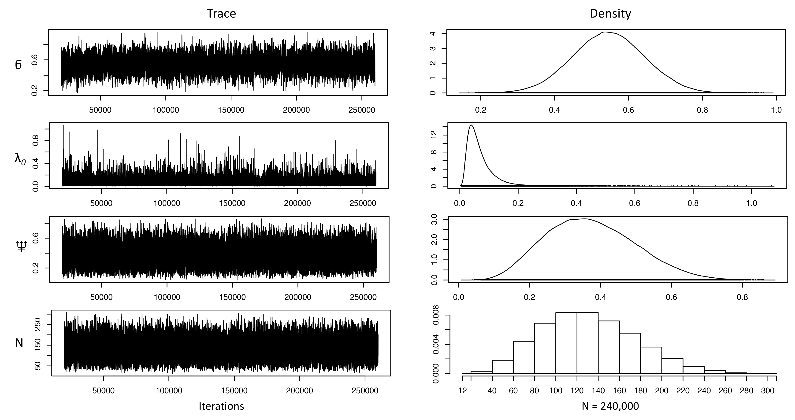
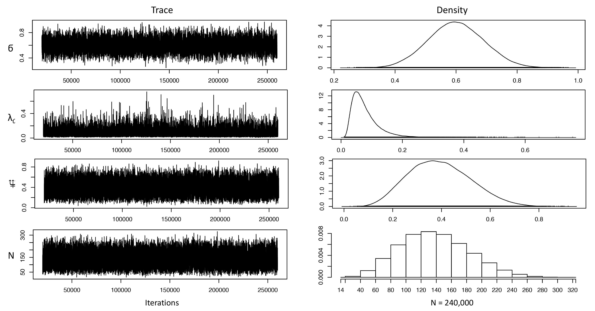

# Counting-cats-for-conservation
This repository provides codes for **Allen, M. L., Wang, S., Olson, L. O., Li, Q., & Krofel, M. (2020). Counting cats for conservation: seasonal estimates of leopard density and drivers of distribution in the Serengeti. Biodiversity and Conservation, 1-18.**.

## Abstract
Large carnivore conservation is important for ecosystem integrity and understanding drivers of their abundance is essential to guide conservation efforts. Leopard (Panthera pardus) populations are in a general state of decline, although local studies demonstrated large variation in their population trends and density estimates vary widely across their range. We used spatially-explicit capture-recapture models for unmarked populations with camera trap data from a citizen science project to estimate previously-unknown leopard population densities in Serengeti National Park, Tanzania, and determine potential biological drivers of their abundance and distribution. We estimated leopard densities, at 5.41 (95% CrI = 2.23–9.26) and 5.72 (95% CrI = 2.44–9.55) individuals/100 km2, in the dry and wet season, respectively, which confirmed Serengeti National Park as one of the strongholds of this species in Africa. In contrast to abundance estimates, we found that drivers of leopard abundance and distribution varied among the dry and wet seasons, and were primarily affected by interactions with other larger carnivores and cover. The underlying driver of leopard distribution may be the dynamic prey availability which shifts between seasons, leading to an avoidance of dominant carnivores when prey availability is low in the dry season but an association with dominant carnivores when prey availability is high in the wet season. As efforts to conserve large carnivore populations increase worldwide, our results highlight the benefits of using data from citizen science projects, including large camera-trapping surveys, to estimate local carnivore abundances. Using a Bayesian framework allows of estimation of population density, but it is also important to understand the factors that dictate their distribution across the year to inform conservation efforts.
Note the project include two parts, dry season and wet season.

## MCMC outputs
### Dry season

### Wet season

## Reference

*Allen, M. L., Wang, S., Olson, L. O., Li, Q., & Krofel, M. (2020). Counting cats for conservation: seasonal estimates of leopard density and drivers of distribution in the Serengeti. Biodiversity and Conservation, 1-18.*
